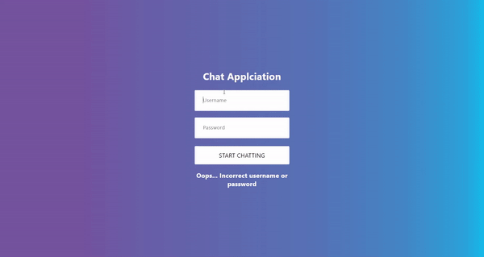
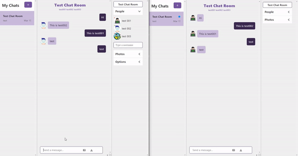

<div id="top"></div>

## React Chat App

A react realtime chat app project learning from youtube.

Users can login and then send message and upload image in your chat room.

You can check out the live project ([netlify](https://www.netlify.com/)) by clicking **[Chat App](https://rjun-chat-app-project.netlify.app/)**

<!-- PROJECT Demo -->
<div align="center">
  <h3 align="center">Demo</h3>
  
  
</div>


## Learn From

**Youtube Video [Chat Application using React JS - Build and Deploy a Chat App in 1 Hour (Microsoft Teams)](https://www.youtube.com/watch?v=jcOKU9f86XE)**

Thanks youtube channel **[JavaScript Mastery](https://www.youtube.com/channel/UCmXmlB4-HJytD7wek0Uo97A)**.

## Built With

* [React.js](https://reactjs.org/)
* [Chat Engine](https://chatengine.io/)
* [CSS Style](https://gist.github.com/adrianhajdin/c3a3195dd091359f3402a572961abb98)

<p align="right">(<a href="#top">back to top</a>)</p>


<!-- GETTING STARTED -->
## Getting Started

This is an example of how you may give instructions on setting up your project locally.
To get a local copy up and running follow these simple example steps.

### Prerequisites

**npm**
```sh
npm install npm@latest -g
```

### Installation

1. Clone the repo
   ```sh
   git clone https://github.com/xxrjun/chat-app.git
   ```
2. Install NPM packages
   ```sh
   npm install
   ```

### Run the App in Develop Mode
```sh
npm start
```

<p align="right">(<a href="#top">back to top</a>)</p>


<!-- ACKNOWLEDGMENTS -->
## Acknowledgments I Learned From This Project

* [Chat Engine](https://chatengine.io/)
* [react-chat-engin](https://www.npmjs.com/package/react-chat-engine)

<p align="right">(<a href="#top">back to top</a>)</p>
